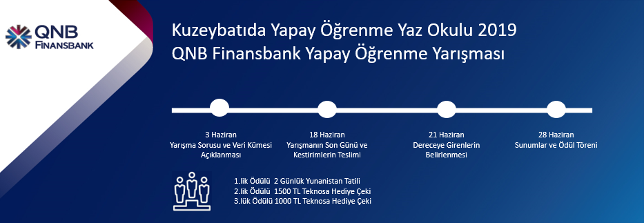

# Kuzeybatıda Yapay Öğrenme Yaz Okulu 2019 
## QNB Finansbank Yapay Öğrenme Yarışması

### Yarışma Problemi
Çağrı merkezini arayan müşterilerin, müşteri temsilcileri ile aralarında yapmış oldukları konuşmaların hangi kategorilere ait olduğunu kestirme problemininin çok etiketli (multi-label) olarak sınıflandırılması. 

### Çözüm
Kaggle kernel ile GPU üzerinde keras kullanılarak LSTM ve GRU, Attention katmanı ile birlikte kullanılmıştır.Veri setinde kelimeler üzerinde önişleme yapılıp kök haline getirildiği için sadece keras'ta modellenebilir hale gelmesi amacıyla tokenizer işlemleri yapılmıştır.56 farklı etiket olduğu için modelin çıktı katmanında sigmoid seçilmiş ve döngü kullanılarak her bir etiket için eğitim yapılmıştır. Bu çözüm ile finalde sunum yapmaya hak kazandım. 

